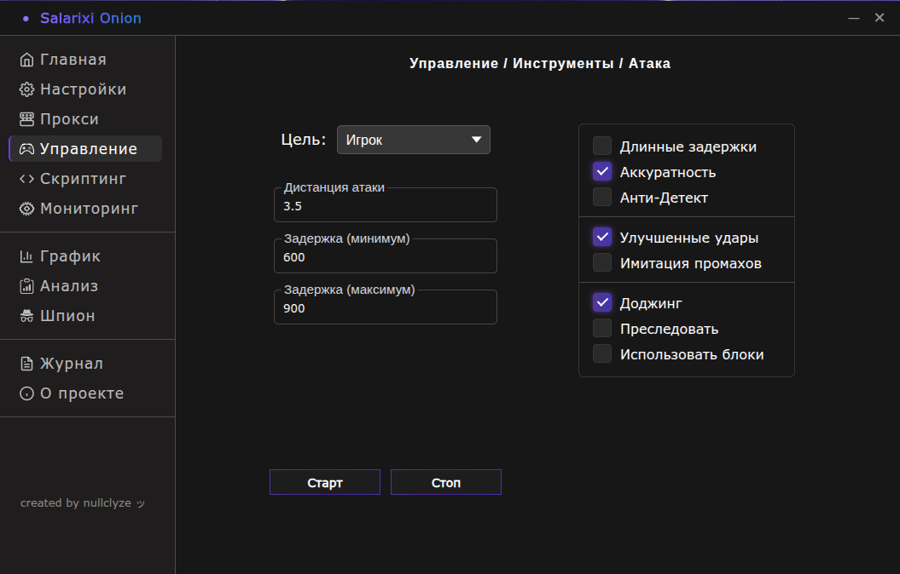
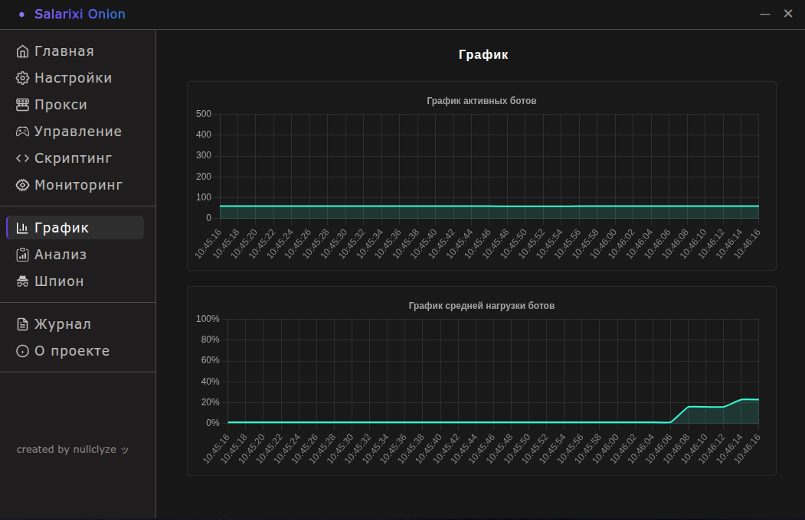

# About the project

[Telegram Official](https://t.me/salarixionion) / [YouTube Official](https://www.youtube.com/@salarixionion)

⭐ **Salarixi Onion** allows you to launch a specific number of bots on **Minecraft servers** and manage them in real time. The client is **very user-friendly** and **easy to use**, offering **great flexibility** and **functionality**. This client also has **unique** functionality: Flight, Ghost, Spoofing, Sprinter.

📌 This client uses the [mineflayer](https://github.com/PrismarineJS/mineflayer) library as a base.

# Features

- 💫 Easy to use
- ⚡ Fast and smart
- 💎 Absolutely free
- 💥 Beautiful design
- ✨ Clear logic
- 💕 Open source
- 🌀 Great functionality
- 💯 Good optimization
- ♾️ Good flexibility of settings
- 📊 Data visualization
- 🌐 Real-time monitoring
- 📅 Event logging
- 💦 Good stability
- 🧨 Cheat functions
- 💻 Hack functions
- 🌏 Support for regular proxies (SOCKS5, SOCKS4, HTTP)
- 📶 Premium proxy support
- 🎁 Creating your own scripts
- 💾 Support for multiple Minecraft versions

# Gallery

# How to install

## Windows

1. Install the latest release of the project from **GitHub**
2. Unzip the downloaded archive
3. Go to the unzipped folder
4. Run the file **tools.exe** and wait until it starts completely
5. Run the main file **salarixionion-YOUR_VERSION.exe**
6. Ready

## Linux

1. Install the latest release of the project from **GitHub**
2. Unzip the downloaded archive
3. Go to the unzipped folder
4. Run the file **tools** and wait until it starts completely
5. Grant execute permission to the file **salarixionion-YOUR_VERSION.AppImage** and run it
6. Ready