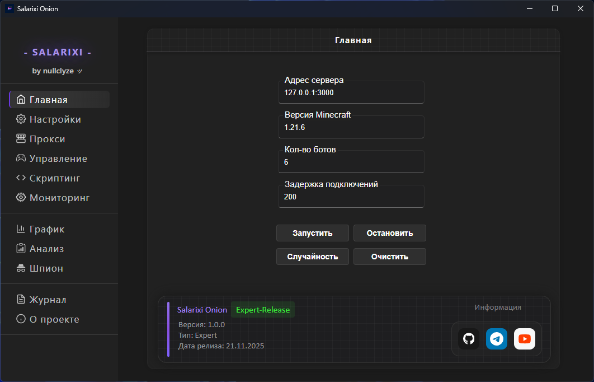
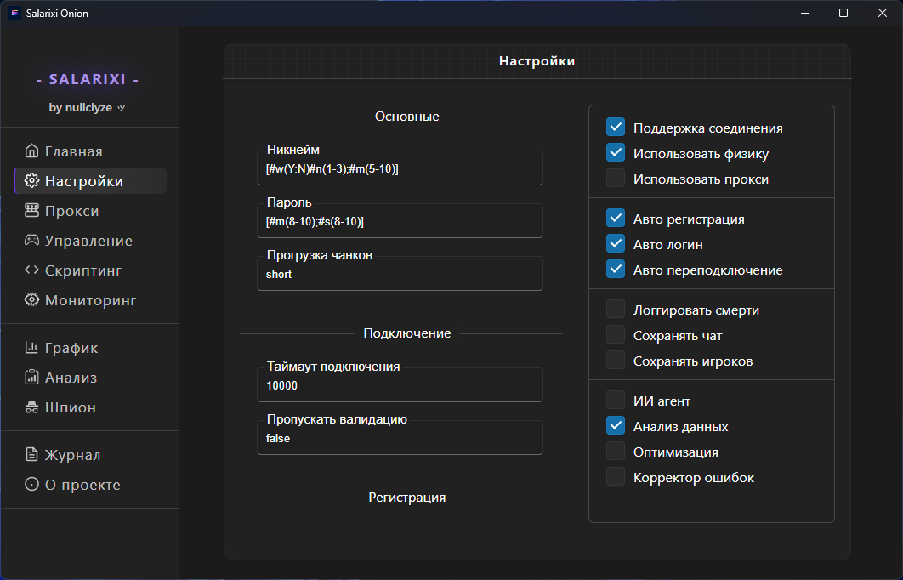
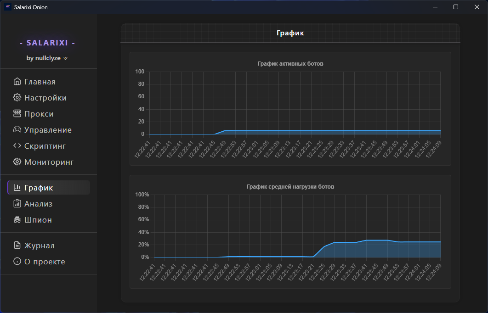
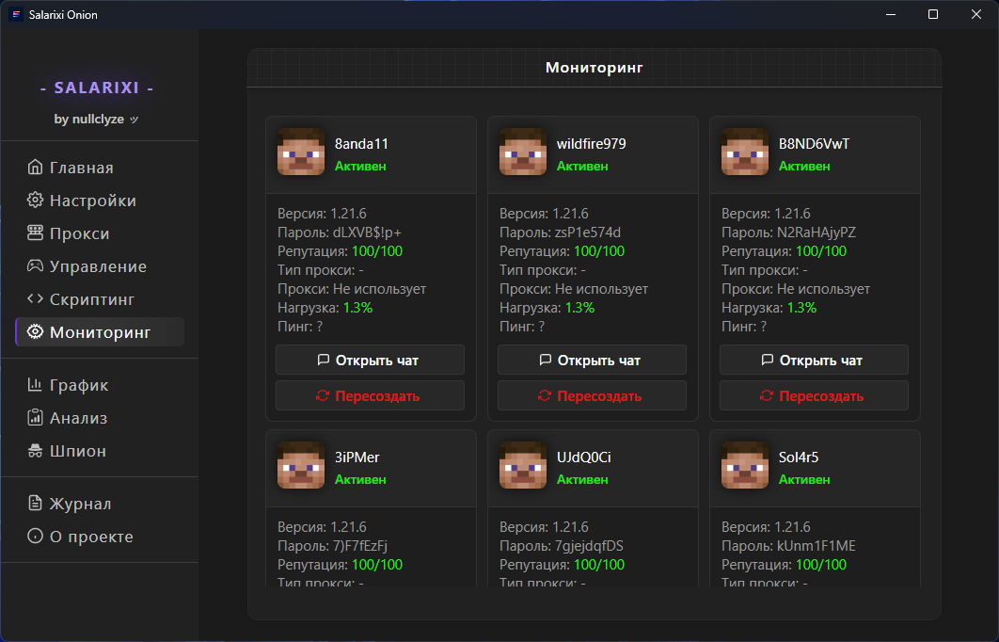

# Warning

**‼️ This client is still under development and may contain frequent errors and bugs. Please use with caution.**

# About the project

[Telegram Official](https://t.me/salarixionion)
 
[YouTube Official](https://www.youtube.com/@salarixionion)

⭐ **Salarixi Onion** allows you to launch a specific number of bots on **Minecraft servers** and manage them in real time. The client is **very user-friendly** and **easy to use**, offering **great flexibility** and **functionality**.

✨ The client gives you **full control** over bots, from chat messages to various cheating functions.

📌 This client uses the [mineflayer](https://github.com/PrismarineJS/mineflayer) library as a base.

# Features

- 💫 Easy to use
- ⚡ Fast
- 💎 Absolutely free
- 💥 Beautiful design
- ✨ Clear logic
- 💕 Open source
- 🌀 Great functionality
- 💯 Good optimization
- ♾️ Good flexibility of settings
- 📊 Data visualization
- 🌐 Real-time monitoring
- 📅 Event logging
- 💦 Good stability
- 🧨 Cheat functions
- 💻 Hack functions

# Gallery

**Client settings page**

**Client control page**

**Client graphic page**

**Client monitoring page**

# How to install

## Method 1

1. Install the latest release of the project from **GitHub**
2. Unzip the downloaded archive
3. Go to the unzipped folder
4. Find the file there **salarixi-loader.exe**
5. Run the loader
6. Wait until the client is fully launched

## Method 2

1. Install the latest release of the project from **GitHub**
2. Unzip the downloaded archive
3. Go to the unzipped folder
4. Go to the directory **./services**
5. Run the file **so-utils.exe**
6. Run the file **so-core.exe**
7. Run the file **so-interface.exe**

# Licence 

MIT License - [LICENSE](./LICENSE)

