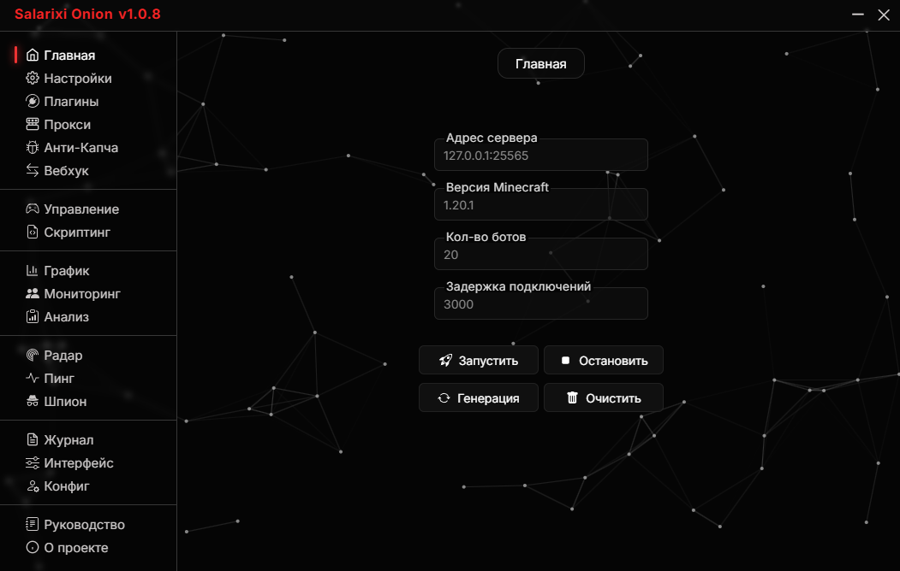
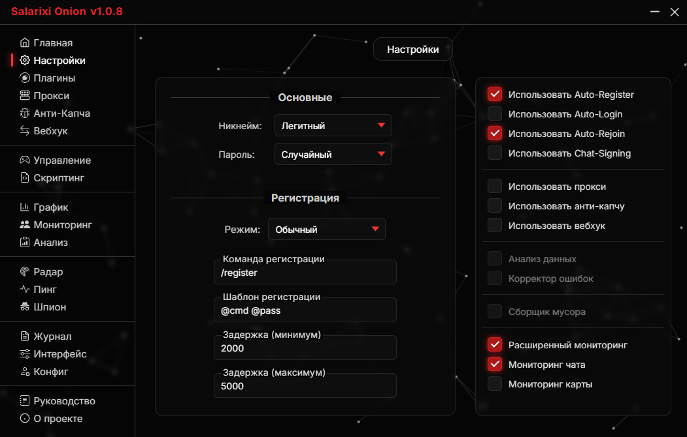
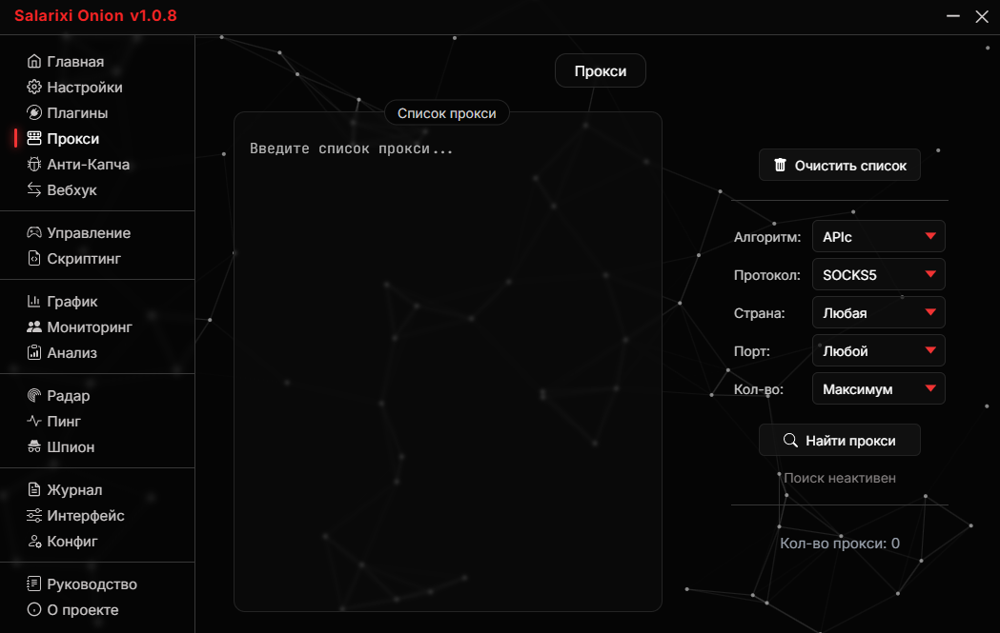
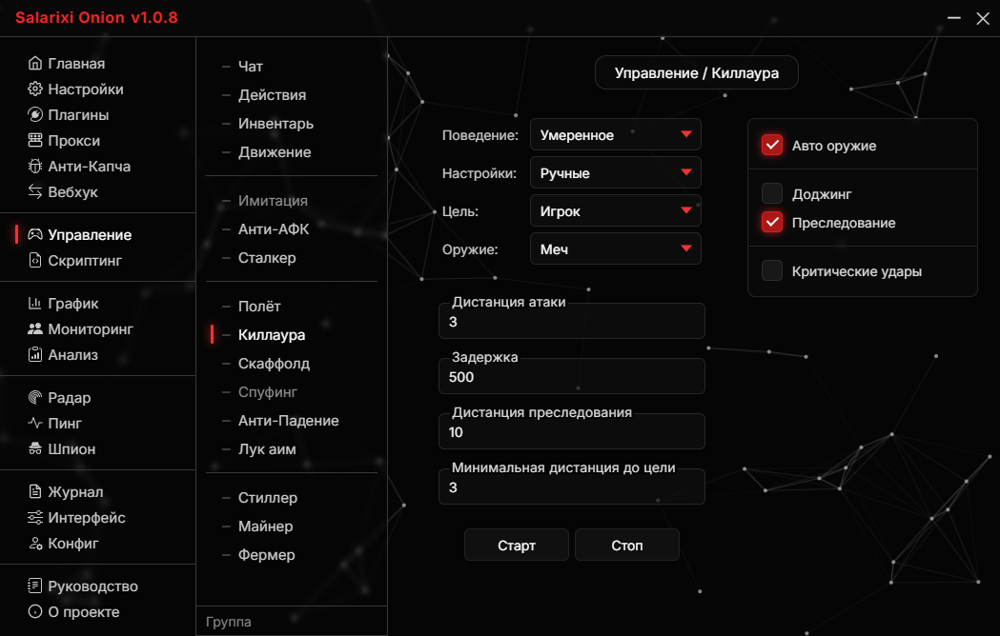
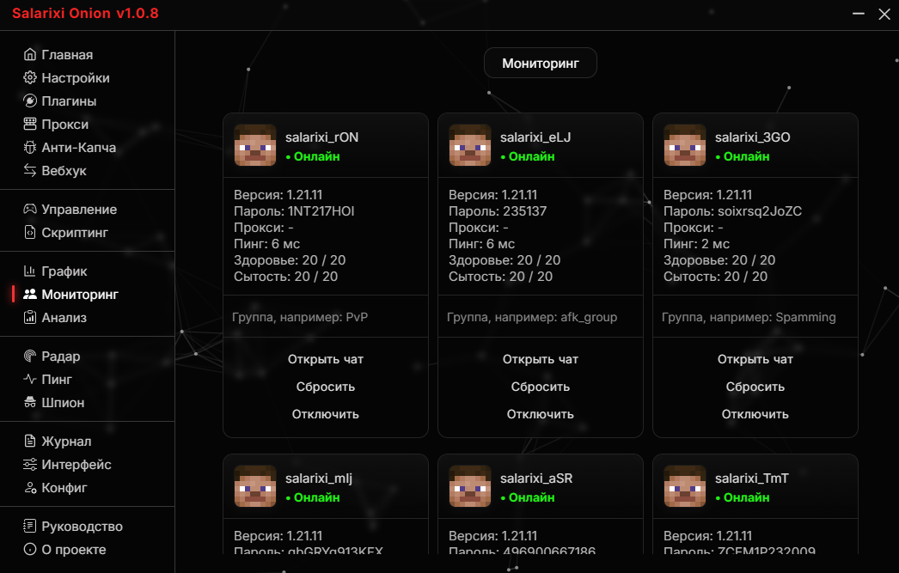
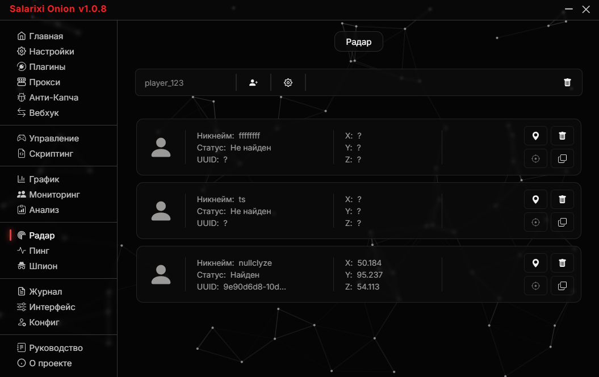
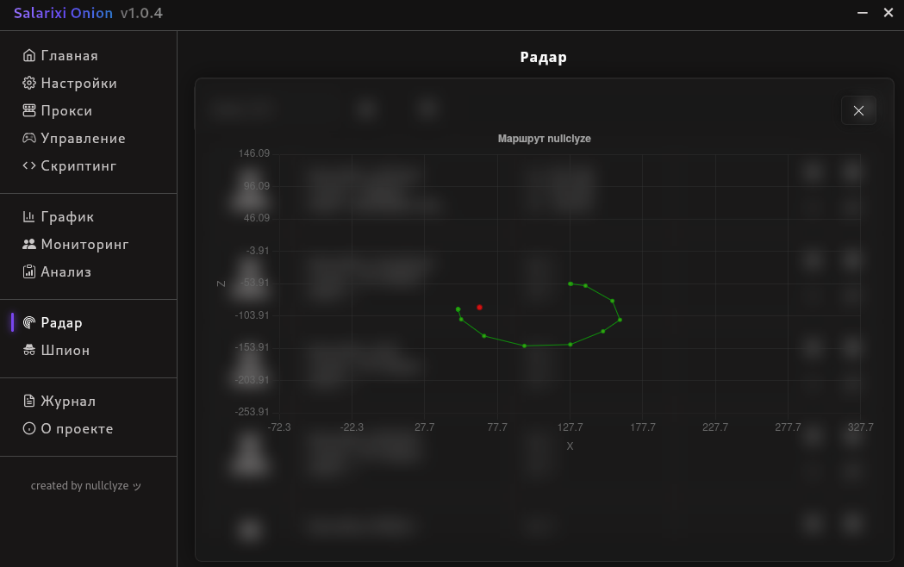
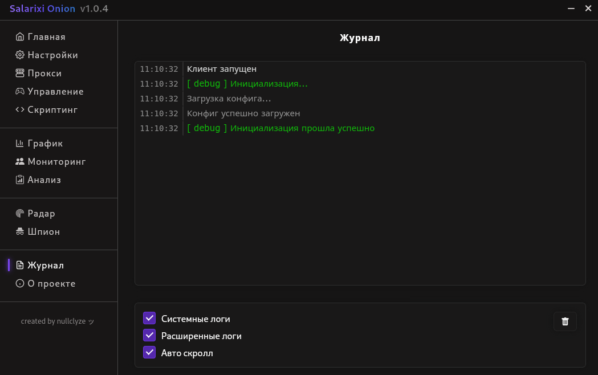

# ✨ Salarixi Onion - Minecraft Botting Client

## 🎯 About

**Salarixi Onion** - A functional, optimized, simple, and smart client for Minecraft botting. It has a large number of settings that can be quickly adjusted to your goals. The client also offers many functions for managing bots, which also have options for configuring a particular process. The client is also unique for its optimized and fast monitoring capabilities (graphs, bot profiles, bot chats), they allow you to filter data on the fly, command certain bots.

This client uses the [azalea-rs](https://github.com/azalea-rs/azalea) library as a base.

📌 The official author of this client is **nullclyze**.

> [!WARNING]
> This client does not promise stability and good support on all operating systems. If you encounter any problems, please report them to the [issues](https://github.com/nullclyze/SalarixiOnion/issues).

## 🔗 Social

- [Telegram](https://t.me/salarixionion) - Our official Telegram channel, where we publish client news and upcoming plans
- [YouTube](https://www.youtube.com/@salarixionion) - Our official YouTube channel, where we publish video reviews of the client
- [Discord](https://discord.gg/meSaZdARX) - Our official Discord server, where we communicate and share ideas

## 💻 System Requirements

- **Operating system:** Windows, Linux
- **Free disk space:** 60 MB
- **RAM:** 4 GB
- **Processor:** Average
- **Dependencies:** None

## 📖 Overview

**Salarixi Onion** is a massive Minecraft botting client. It can be used for stress testing, server analysis, surveillance, bot attacks, and automated farming. The client is actively being developed, improved, and updated, constantly adding new amazing features, new schemes, new algorithms, and new capabilities.

The client has several large sections, they will be presented below in the table.

| Name |            Description                                |
|------|-------------------------------------------------------|
| Main / Главная |  Starting and stopping bots, basic settings           |
| Settings / Настройки     |      Various bot settings       |
| Proxy / Прокси    | Setting up a proxy for bots            |
| Control / Управление     |  Real-time bot management           |
| Scripting / Скриптинг     |  It doesn't work          |
| Monitoring / Мониторинг     |  Real-time bot monitoring           |
| Graphic / График     |  Data in the form of graphs          |
| Analysis / Анализ     |  It doesn't work          |
| Spy / Шпион     |  It doesn't work          |
| Radar / Радар     |  Detection of players and their positions          |
| Log / Журнал     |  Event logging         |
| About / О проекте     |  Just a section about the project         |

## 💥 Features

- 🚀 **Easy to use:** Quick adaptation to the client. Intuitive interface.
- ⚡ **Fast and smart:** All transactions in the client are fast. The client contains several smart managers for any tasks.
- 💎 **Absolutely free:** All functionality in the client is free.
- 💥 **Beautiful design:** The client has a clear and beautiful dark design.
- 💕 **Open source:** The client is completely open source.
- 🌀 **Great functionality:** The client offers a lot of functionality that is very flexible in settings and well optimized.
- 📊 **Data visualization:** For convenience, the client visualizes the data in the form of graphs.
- 🌐 **Real-time monitoring:** The client has real-time bot monitoring. It is highly optimized and has customizations.
- 📅 **Event logging:** The client has a log in which any information is logged.
- 🧨 **Cheat functions:** The client contains unique functionality in the form of real cheats for bots.
- 🌏 **Proxy support:** The client supports SOCKS5 proxy.

## 📷 Gallery

















## 💾 Installation

### Windows

1. Download **.msi** file from GitHub
2. Run downloaded file
3. Go through installation process
4. Ready

### Linux

1. Download **.deb** file from GitHub
2. Open directory with downloaded file in terminal
3. Write ```sudo dpkg -i FILENAME.deb```
4. Ready

## 📜 Additional Information

- **Documentation:** [Docs](./docs/DOCS.md)
- **FAQ:** [FAQ](./docs/FAQ.md)
- **Latest Release:** [Release](https://github.com/nullclyze/SalarixiOnion/releases/tag/v1.0.4-release)
- **License:** [MIT License](./LICENSE)
